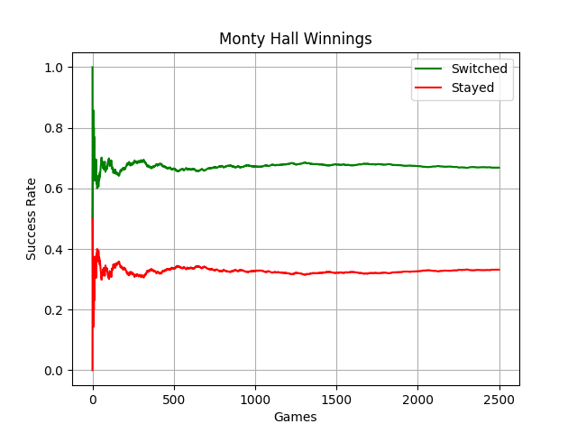

**Monty Hall problem for Python 3.11**
======================================

Should the game contestant stay with their chosen door? Or switch to another?

Some Things Required
--------------------

* **Windows 11**

  This code will still run on Windows 10.

* **Python 3.11**

  This code was written using Python 3.11.6.

* **matplotlib 3.8.0**

  For graphics plotting.

Don't Have Python?
------------------

The .EXE (in the dist folder) can be run in Windows 11 or 10.

.. |ss| raw:: html

    <strike>

.. |se| raw:: html

    </strike>

Things To-Do
------------

| Instruction manual.
| Cheat codes.
|ss|

| Start on a To-Do.

|se|

**Known History**

* init version

  Uses pydice for it's random numbers.

Contact
-------
Questions? Please contact shawndriscoll@hotmail.com
